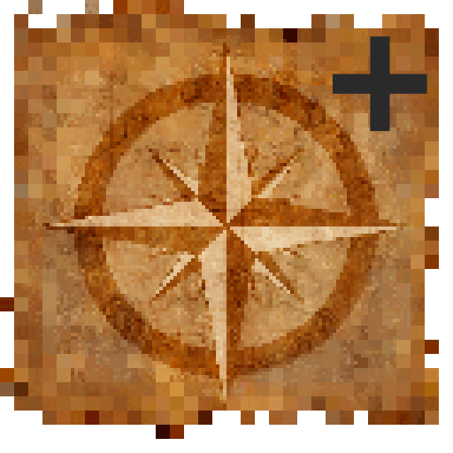

# Just Map

A minimap mod for Minecraft with Fabric launcher. [Original](https://github.com/Bulldog83/JustMap)

Mod page on [CurseForge](https://www.curseforge.com/minecraft/mc-mods/just-map) \
Translation via [Crowdin](https://crowdin.com/project/justmap)

## Requirs

 * MC version 1.19.1
 * fabric 0.14.8
 * [fabric-api-0.58.5+1.19.1](https://www.curseforge.com/minecraft/mc-mods/fabric-api)
 * [cloth-config-8.0.75-fabric](https://www.curseforge.com/minecraft/mc-mods/cloth-config)
 * [modmenu-4.0.5](https://www.curseforge.com/minecraft/mc-mods/modmenu)
 
## Updating for new Minecraft version

1. Visit https://fabricmc.net/develop/ for latest settings
2. Paste settings into `gradle.properties` and increase mod version
3. Check `fabric.mod.json` is using the correct target version of Minecraft and `fabricloader`
4. Run `.\gradlew vscode`
5. F5 and test the mod is working
6. Run `.\gradlew build`
7. Publish /build/libs/justmap-x.x.x-x.x.x-release.jar

If there is a loom version error at 4 above, update `build.gradle` with the latest version from the example mod template here: https://github.com/FabricMC/fabric-example-mod/blob/master/build.gradle
